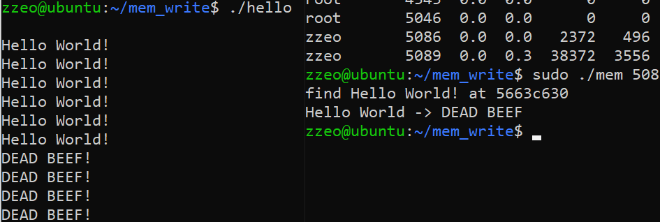

Linux有procfs，里面的文件实时反应了当前系统运行的状态。而且对于每个进程都有一个独立的文件夹，记录了进程所有的信息。

这里主要用到两个文件maps文件和mem文件，通过maps文件可以了解当前进程空间的布局，通过mem文件可以读写进程的虚拟内存空间。结合这两者就可以完成进程注入，控制流劫持，反正是为所欲为。

一个例子：

hello程序会接受用户输入，没有一次输入就打印一次Hello World!。mem程序就会打开hello进程的mem文件，找到Hello World!字符串的位置，并将其改为DEAD BEEF!。示意图如下

